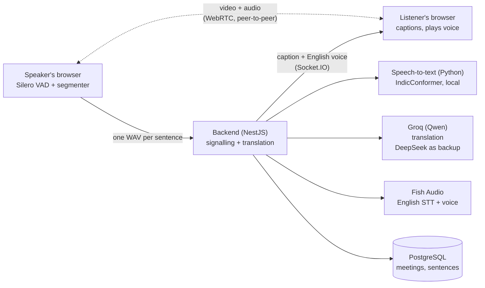
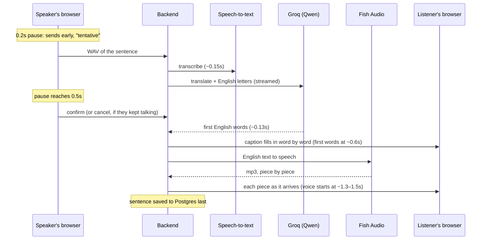

# Meet Translate

Video meetings where people speaking **Hindi, Telugu, Tamil or Kannada** are
heard in **English** by everyone else — as a live caption and a spoken
English voice, with the original speaker muted for English listeners.

Under each English caption, what the speaker actually said is shown in
English letters, the way people type Hindi or Telugu on their phone,
instead of in the native script:

> **How are you? Let's start today's meeting.**
> Hindi: aap kaise hain chaliye aaj ki meeting shuru karte hain

So an English listener who half-knows the language can follow the original
too.

## Live demo

**https://absinthe-croak-subsystem.ngrok-free.dev**

- Hosted from my laptop through ngrok, so it's online when I'm running it.
  If it doesn't load, it's offline; ask me and I'll start it.
- ngrok shows a one-time "You are about to visit" page first; click
  **Visit Site**.
- Creating a meeting needs an **access code** (ask me for it). Joining by
  invite link doesn't. Open the link on two devices, one speaking Hindi,
  Telugu, Tamil or Kannada and one listening in English, with headphones.

## At a glance

### Delay
- **First English words on the listener's screen: 0.52–0.69s** after the
  speaker stops (up to ~1s when Groq is having a slow moment); the finished
  caption at 0.58–0.76s; **the English voice starts playing at 1.26–1.48s**.
  Measured end to end through two browser tabs with real speech recognition,
  translation and voice (Hindi and Telugu), on the same laptop.
- **Over the internet** (both tabs going through the public Cloudflare
  links, as a remote user would): first English words **0.79–0.99s**, voice
  **1.15–1.50s**, all 4 languages translated correctly.
- **Original target: under 4s.** Then pushed to under 0.7s for the first
  words, and met. How: [Getting under 0.7s](#getting-under-07s).

### Stack
- **Frontend:** Next.js, React, TypeScript, Tailwind; WebRTC for video
  (with an ExpressTURN relay for networks that block direct connections),
  Socket.IO, Silero VAD for voice detection in the browser.
- **Backend:** NestJS, Socket.IO, Prisma, PostgreSQL.
- **Speech-to-text:** Python (FastAPI) running AI4Bharat's IndicConformer
  locally for Hindi/Telugu/Tamil/Kannada; Fish Audio for English.
- **Translation:** Qwen (`qwen3.8-27b`) on Groq, with DeepSeek
  (`deepseek-flash`) as automatic backup.
- **English voice:** Fish Audio.

### Problems faced, and how they were fixed
1. **Fish turned Telugu, Tamil and Kannada into Malay gibberish** and took
   4–6s → switched to a local IndicConformer model: correct, ~0.2s, free.
2. **The GPU was slower than the CPU** for that model (450ms vs 190ms) →
   CPU with tuned thread settings.
3. **Hugging Face was blocked over IPv6** on the internet provider → the
   model download is forced over IPv4.
4. **Noise and the English voice playback were picked up as speech** →
   Silero VAD instead of a loudness check, and the mic is ignored while the
   voice plays.
5. **A different voice every sentence, plus lag** → one pinned voice,
   DeepSeek's "thinking" step turned off, caption sent before the voice.
6. **Chinese characters in translations, and a cough captioned as "啊"** →
   a stricter English-only instruction and a filter.
7. **A faster translator (IndicTrans2) was less accurate** → accuracy was
   chosen and DeepSeek kept.
8. **On the real call, most mistakes came from people on the wrong
   language** → clearer labels and a hint line saying what your choice
   means right now.
9. **Long sentences were cut mid-word** → cut at the next natural pause.
10. **Captions took 1.1–1.6s** → streamed word by word, started early,
    a 250ms Windows `localhost` delay removed, and Groq as the translator:
    now 0.52–0.69s.
11. **Sentences over 4s were cut in two**, sometimes mid-word, and the
    second half mistranslated → the cut moved to 8s.
12. **A sentence after a pause was translated without what came before**
    ("the Pledge of Allegiance" for a misheard "today's meeting") → the
    translator gets the meeting's last 3 sentences as background.
13. **The first sentence of a call took 2.4s** (the speech model's first
    run per language is slow) → each language is run once at startup.
14. **On a real call between two different Wi-Fi networks, the other
    person's real voice and video never arrived** (the direct
    browser-to-browser connection was blocked, and there's no TURN relay)
    → the server also relays the speaker's own recorded sentence, played
    only when the direct connection is down; the tile says so instead of
    staying black. And sound now has its own `<audio>` element, because a
    `<video>` stays silent until a picture arrives. Then a **TURN relay**
    (ExpressTURN's free tier) made video and the real voice live again on
    blocked networks; the per-sentence relay stays as the last resort.

More detail on each in [Decisions](#decisions-and-what-each-was-based-on).

### Limitations
- Translates **only into English**.
- **Speakers pick their language manually**; a wrong choice gives
  gibberish.
- **No user accounts.** Creating a meeting needs a shared access code,
  and usage is capped (300 sentences per meeting, 500 English voices a
  day), so a leaked link can't run up the paid voice service.
- **Hosted from a laptop** through a fixed ngrok address: online only
  while it's running, and ngrok's free plan shows visitors a warning page
  (with the laptop's internet address) first.
- **About 6 people per meeting**: everyone connects to everyone.
- **Blocked networks rely on a free TURN relay** (ExpressTURN, 1,000 GB a
  month). Between some networks (two different home Wi-Fis, in a real test)
  the direct connection is blocked; the relay carries the live video and
  voice then. If it's ever unavailable or not configured, there's no video
  and the real voice arrives after each sentence (~1s, relayed by the
  server). Captions and the AI voice are unaffected either way. The TURN
  login is static, so meeting participants' browsers can see it.
- **Depends on external services**: Groq (free tier: ~20 sentences a
  minute, 1,000 a day; past that it falls back to DeepSeek at ~1.2s), DeepSeek
  and Fish Audio.
- **Tamil and Kannada** were tested only with generated audio, not a real
  speaker.

### Pros
- **Solves a real Indian problem** with the first English words on screen
  in under 0.7s, and the English voice playing in under 1.5s.
- **Accurate for Indian languages**: a model built for them, plus a
  translator that repairs misheard words.
- **English letters under each caption** ("aaj ki meeting mein kya hua")
  so listeners can follow the original words too.
- **Cheap**: speech-to-text is local and free; translation and voice cost a
  fraction of a rupee per sentence.
- **Private, fast video**: it goes straight between browsers, never through
  the server (only per-sentence voice recordings are relayed, and only when
  a network blocks the direct connection).
- **Tested with real people**, with measured numbers and every decision
  written down.
- **Well documented and tested**: system design, decisions, a health
  check endpoint, 32 backend tests.

## In the meeting

- **Pick the language you will speak.** English means "I want to hear
  everyone else in English". A line under the header says what your choice
  does right now, including when nothing is being translated because nobody
  is on English. It can be changed mid-call.
- **Captions** stay scrolled to the newest one, unless you scroll up to
  re-read.
- **Video tiles** show each person's name and language. Someone with no
  camera, or with it off, shows as their initial. Your own camera is
  mirrored, and your tile says "mic off" while you're muted. If the network
  blocks a direct connection to someone, their tile says so, and you still
  hear their real voice, a moment after each sentence.
- **Mute and Camera off turn red** while off. "Translated voice" (English
  listeners only) switches between the English voice and the speaker's own.
- Alone in a call, a tile offers the invite link to copy.

## Measured

Recorded sentences played into one browser tab's microphone, with the
caption timed in a second tab listening in English. Real speech recognition
and translation, on a laptop. Times are from when the speaker stops talking.

| | First English words | Finished caption |
|---|---|---|
| Hindi (3 runs) | 0.67–0.69s | 0.74–0.76s |
| Telugu | 0.52s | 0.58s |

| English voice | Starts playing |
|---|---|
| Hindi (3 runs, voice played while still arriving) | **1.26–1.48s** |
| Same runs, if it had waited for the whole file (as before) | ~1.65–1.9s |

| Version | First caption words | English voice |
|---|---|---|
| First version (whole caption at once, DeepSeek) | ~1.6s (estimated) | ~2.2–2.7s |
| + streaming, early start, `localhost` fix | 1.1–1.3s | |
| + Groq instead of DeepSeek | **0.52–0.69s** | ~1.65–1.9s |
| + voice played while it's still arriving | | **1.26–1.48s** |

**Over the internet**: both tabs through the public Cloudflare links, one
recorded sentence in each language, then Hindi and Telugu again:

| | First English words | Voice starts | Translation |
|---|---|---|---|
| Hindi, first sentence of the call | 1.22s | 1.71s | ✅ |
| Telugu, Tamil, Kannada, Hindi | 0.79–0.99s | 1.15–1.50s | ✅ all 9 captions |

The tunnel and a busy CPU add ~0.3s over the same-laptop numbers above.

**Real two-person call after the speed-ups** (two devices on two
different Wi-Fi networks, Hindi ↔ English): 32 translated sentences, no
errors. Server time to the first English words: **median 0.61s**, 90% under
1.03s; to the first voice audio: **median 1.03s** (add ~0.3s for the
listener's screen). Nearly every sentence was right, including a garbled
"Echo Dot" the translator repaired from context. This call is also where
the blocked direct connection showed up (see problem 14).

**First real two-person call** (two people, two devices, different networks,
Hindi speaker → English listener and back, before the speed-ups above):
server time from receiving a sentence to sending its caption was **0.79s
median, 1.5s for 90% of sentences**, over 75 sentences. Most mistakes in that call came from someone
being on the wrong language, which is what the hint line above now
addresses.

## Getting under 0.7s

| Step | Before | Now |
|---|---|---|
| Noticing the speaker stopped | waits 0.5s | starts at 0.2s, confirms at 0.5s |
| Reaching speech-to-text | +~0.25s (Windows `localhost` tries IPv6 first) | 127.0.0.1, no delay |
| Speech-to-text | ~0.15s | ~0.15s |
| Translation's first words | ~0.6s (DeepSeek), whole caption at the end | ~0.13s (Groq), caption fills in word by word |
| **First English words on screen** | **~1.6s** | **0.52–0.69s** |
| English voice | waits for Fish's whole file (~1.1s) | plays from Fish's first piece (~0.35s) |
| **English voice starts** | **~2.2–2.7s** | **1.26–1.48s** |

## Three parts

| Folder | What | Stack |
|---|---|---|
| `frontend/` | The meeting page: video (WebRTC), voice detection, captions | Next.js, React, TypeScript, Tailwind |
| `backend/` | Signalling, the translation pipeline, saved transcripts | NestJS, Prisma, PostgreSQL, Socket.IO |
| `asr/` | Speech-to-text for the four Indian languages | Python, FastAPI, AI4Bharat IndicConformer |

`asr/` is Python only because the model ships as Python code. It runs locally
on the CPU (~0.2s per phrase), so it costs nothing per use.

### Which service does what, and why

| Step | Used | Why this one |
|---|---|---|
| Is the mic audio speech? | **Silero VAD** (in the browser) | A loudness check let clicks, noise and the translated voice through as "speech" |
| Speech → text (Indian languages) | **IndicConformer** (local) | Fish returned gibberish for Telugu/Tamil/Kannada and took 4–6s; this got them right in ~0.2s |
| Speech → text (English) | **Fish Audio** | Accurate for English |
| Text → English, plus the original in English letters | **Qwen on Groq** (`qwen3.8-27b`, thinking off), **DeepSeek** as backup | Groq's first words in ~0.13s vs DeepSeek's ~0.6s, equal accuracy on 12 of 14 real transcripts; DeepSeek takes over when Groq's free quota runs out. Both lines come back from one call as JSON `{english, romanized}`, streamed, so the English-letters line adds no delay. A rule-based transliterator spells stiffly (`Aja kI mITiMga`) |
| English text → voice | **Fish Audio** | Consistent voice (`FISH_VOICE_ID`) |

## System design



**Two separate paths.** Video and the speaker's real voice go straight
between browsers over WebRTC and never touch the server; the backend only
passes along the connection details (signalling). Translation is the other
path: one WAV per sentence goes to the backend, and the caption and English
voice come back over the same Socket.IO connection. When a network blocks
the direct path, that same per-sentence WAV doubles as the fallback for the
real voice: the server relays it, and it plays only while the direct
connection is down.

**One sentence, end to end** (measured; times from when the speaker stops):



**What keeps it fast**
- The caption goes out the moment the translation exists; it doesn't wait
  for the voice.
- The voice is pushed only to English listeners, with no extra request,
  and starts playing from its first piece while the rest is still being
  generated.
- Saving to Postgres happens after the caption, so it never adds delay.
- Nothing is translated unless someone is listening in English.
- The translation and the English-letters line come from one call,
  streamed, so the caption fills in word by word.
- Work starts after a 0.2s pause; if the speaker carries on it's cancelled,
  so where sentences end (and translation quality) doesn't change.

**Live state vs. history.** Who is in a meeting right now (connection,
name, language) is kept in memory (`PresenceService`): signalling and the
"is anyone listening in English?" check read it all the time, and an open
connection isn't something a database row can represent. History lives in
Postgres: `Meeting` → `Participant` → `Utterance` (original text, English
letters, translation).

**When something fails**
- A Fish/DeepSeek error (no credit, bad key) reaches the speaker with the
  real reason, not a blank 500.
- If the voice fails, the caption has already arrived, and the listener's
  player is told the voice has ended so it never waits for it.
- If saving fails, it's logged and the call carries on.
- `GET /api/health` reports whether the database and the speech-to-text
  service are up.
- If the direct connection between two browsers is blocked (it was,
  between two home Wi-Fi networks), the call goes through a **TURN relay**
  instead: live video and voice, just routed via the relay. The browser
  gets the relay's address and login from the server when it joins.
- If even that fails, captions and the AI voice still work since they go
  through the server, and the speaker's real voice is relayed by the server
  too: each confirmed sentence's recording goes to everyone who hears the
  real voice, and a browser plays it only while its connection to that
  speaker is down, so there's no echo when it works. A connection not up
  after 10s counts as failed, and the tile says so.

**Limits, and how it would scale**

| Limit today | Why | How it would scale |
|---|---|---|
| ~6 people per meeting | Everyone connects to everyone (6 people = 15 connections) | A media server (SFU, e.g. LiveKit): each person sends one stream |
| Speech-to-text throughput | One CPU process, ~0.2s per sentence | More worker processes behind a queue; a GPU with batching at higher volume |
| One backend server | Who is online lives in one server's memory | Move it to Redis, with Socket.IO's Redis adapter |
| Groq's free tier | ~20 sentences a minute, 1,000 a day; past that, DeepSeek at ~1.2s | A paid Groq plan, or a local translator on a GPU once one is accurate enough |
| The English voice is the slowest part | Fish takes ~0.35s before the first piece of audio | A faster voice service (Groq's Orpheus: ~0.2s, but only 100 sentences a day free), or a local voice model on a GPU |
| No login or usage limits | Anyone with the link can spend credit | Meeting passwords or login, plus per-meeting limits |
| Free TURN relay | 1,000 GB a month of relayed video/voice; a static login | A paid or self-hosted relay (coturn) with short-lived logins issued per meeting |

## Decisions, and what each was based on

Each of these was decided by testing the alternatives, not by guessing.

**1. A local model for Indian-language speech-to-text, not Fish.**
Fish got Hindi right, but returned Telugu, Tamil and Kannada as Malay
gibberish (it detected the language as "ms"), taking 4–6s per sentence. Its
language hint doesn't force the language. AI4Bharat's IndicConformer, built
for Indian languages, got all four right in ~0.2s, runs locally and costs
nothing per sentence. Fish is still used for English, where it's accurate.

**2. CPU, not GPU, for that model.** Counter-intuitive, but measured: the
GPU (RTX 4050) took ~450ms per sentence against ~190ms on the CPU, because
this model's GPU kernels are slow. Tuning the CPU (8 threads, no
busy-waiting) also cut the time under load from 672ms to 343ms.

**3. Accuracy over speed for translation: DeepSeek, not IndicTrans2.**
IndicTrans2 (a local translator) was faster, 0.3–0.4s against 0.5–1s, but
on real speech-to-text output it merged separate sentences ("how are you
starting today's meeting") and translated misheard words literally.
DeepSeek works out where sentences end and repairs mishearings, so it stayed.

**4. One translator call returns both lines.** The English translation and
the speaker's words in English letters ("aaj ki meeting mein kya hua") come
back together as JSON, so the second line adds no delay. A rule-based
transliteration library was the other option, but it spells the way nobody
types ("Aja kI mITiMga").

**5. An AI voice detector in the browser, not a loudness check.** The
loudness check let clicks, background noise and the app's own English voice
through as "speech", which then got translated. Silero VAD recognises actual
speech, and the mic is ignored while the English voice plays.

**6. Caption first, voice second, original muted.** The caption used to
wait for the English voice to be generated. Now it goes out as soon as the
translation exists, and the voice follows only to English listeners. The
original speaker is muted for them, so they never hear a few seconds of
Hindi before the English.

**7. Translate only into English, and only when someone is listening in
English.** A longer language list was tried first. People picked the wrong
language by mistake, which produced garbled captions. Fewer options, and no
translation calls when nobody needs one, which saves credit.

**8. One fixed voice, and DeepSeek's "thinking" turned off.** Fish chose a
different default voice per sentence, so it is pinned (`FISH_VOICE_ID`).
DeepSeek's reasoning step added delay for no gain on one-sentence
translations. The setting that looks like it turns it off
(`reasoning.effort`) is silently ignored; `thinking: {type: 'disabled'}`
is the one that works.

**9. Fixes driven by a real call.** A two-person test on separate devices
and networks showed most mistakes came from people being on the wrong
language, including both being on Hindi with nothing translated. The answer
was clearer labels and a line that says what your choice means right now,
not more features. The same call caught Fish captioning a cough as "啊",
which is now filtered out.

**10. Under 0.7s: streaming, starting early, and Groq.** Measured where
the time went first. Translation was most of it: DeepSeek's first word took
~0.6s (0.3–0.85s). So: the caption fills in word by word as the translation
streams; work starts after a 0.2s pause instead of 0.5s (cancelled if the
speaker carries on, so sentences still end in the same place); and Groq's
Qwen, whose first word takes ~0.13s, replaced DeepSeek after matching it on
12 of 14 real transcripts. A clearer "this word was probably misheard"
instruction fixed its one serious miss. DeepSeek stayed as the backup for
when Groq's free quota runs out. Measuring also found that Windows
"localhost" quietly cost ~250ms per sentence (it tries IPv6 first), fixed
by using 127.0.0.1.

The English voice got the same treatment: Fish sends its audio in pieces
(first after ~0.35s, last after ~1.1s), so each piece is passed straight to
the listener and played while the rest arrives, starting ~0.4s sooner.
Groq's Orpheus voice model was faster still, but its free tier allows only
100 sentences a day and it's a different voice, so Fish stayed.

A fully streaming speech-to-speech model was ruled out: Hindi puts the verb
(and "not") at the end of the sentence, so translating before the sentence
ends means guessing the meaning.

**11. Testing over the internet found three problems same-laptop tests hid.**
A run through the public links, with real 4–5s sentences:
- **The 4s phrase cut** (from the early, slow version, so long monologues
  still got captions) split ordinary sentences, sometimes mid-word, and the
  second half was mistranslated. Now 8s: delay is counted from when the
  speaker stops, so it costs nothing for normal sentences.
- **A sentence after a real pause was translated on its own.** "How are
  you?" and then a Kannada sentence with "meeting" misheard as "loyalty"
  became "the Pledge of Allegiance". The translator now gets the meeting's
  last 3 sentences as background, marked "do not translate", the way a
  human interpreter keeps the conversation in mind.
- **The first sentence of a call took 2.4s**, because the speech model's
  first run per language is slow. The service now runs each language once
  at startup.

**12. A no-account safety net for the real voice, not just "add TURN".**
The proper fix for blocked connections is a TURN relay, but Cloudflare's
asked for a card and the budget is ₹0. Each sentence's recording was
already reaching the server for captions, so relaying it costs no new
service: a listener plays it only while the direct connection is down
(tested both ways: blocked, it played 0.83–1.10s after the sentence;
working, nothing extra played). The trade-off is voice after each
sentence instead of live, and no video.

Then a TURN relay after all, still at ₹0: Cloudflare's and Metered's both
wanted a card, and the public "Open Relay" server turned out to be dead
(tested from the browser: every allocation failed). ExpressTURN's free
tier (1,000 GB a month) needed only an email. Tested with both browsers
refusing direct connections: live video and voice through the relay, and
the per-sentence relay stayed off. Nothing in our code had caused the
blocked connection (two-tab tests connected fine; it depends on the two
networks), so the fix was infrastructure, not undoing changes.

**13. Deployed from a laptop, at ₹0.** The speech model needs ~3–4 GB of
memory, which rules out most free hosting. Hugging Face Spaces was the plan
(one Docker container with everything inside, the model baked in), but
Docker Spaces now need a paid plan. The same container setup (Dockerfile,
Caddy router, start script) is ready for any VPS later. For now the laptop
runs it, published at a fixed ngrok address, with an access code and
usage caps added first so a public link can't spend the voice credit.
Tested through that link: all 9 captions in 4 languages correct, first
English words 0.80–1.04s.

## Running it

1. **Speech-to-text service** (first time: download the model, ~2.4 GB —
   needs a free Hugging Face token in `asr/.env` as `HF_TOKEN=...` and
   access accepted on the
   [model page](https://huggingface.co/ai4bharat/indic-conformer-600m-multilingual)):
   ```bash
   cd asr
   uv sync
   uv run python download_model.py
   uv run uvicorn main:app --port 5001
   ```
   It takes ~30s to start: it loads the model, then runs each language once
   so the first sentence of a call isn't slow. `GET /api/health` on the
   backend says when it's ready.
2. **Backend** — see `backend/README.md` for `.env` (Postgres, Fish, DeepSeek, and optionally Groq and a TURN relay):
   ```bash
   cd backend
   npm install
   npx prisma migrate dev
   npm run start
   ```
3. **Frontend**:
   ```bash
   cd frontend
   npm install
   npm run dev
   ```

Open http://localhost:3000, create a meeting, share the link.

**Testing two people on one laptop:** both browsers hear the same microphone,
so mute one of them and use headphones — otherwise each voice is picked up
twice and the translated voice gets re-captured.

### Publishing it (laptop + ngrok)

Needs `ngrok` and `caddy` (`winget install Ngrok.Ngrok CaddyServer.Caddy`),
and `deploy/.env` (git-ignored) with `NGROK_AUTHTOKEN`, `NGROK_DOMAIN` (a
free static domain from the ngrok dashboard) and `ACCESS_CODE`:

```bash
bash deploy/start-local.sh
```

It builds the app for one address, starts everything behind the same Caddy
router the container uses, opens the ngrok link and prints it once healthy.
`bash deploy/stop-local.sh` stops it. To run it on a server instead, the
`Dockerfile` builds the whole app as one container.
