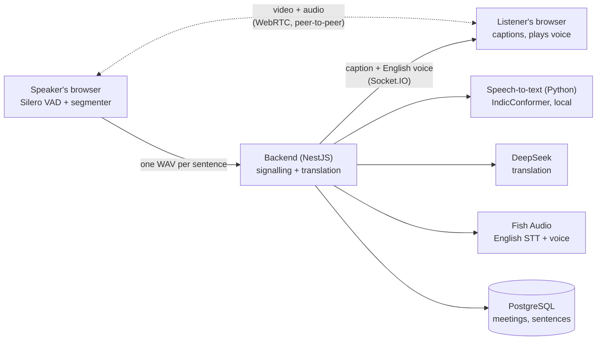
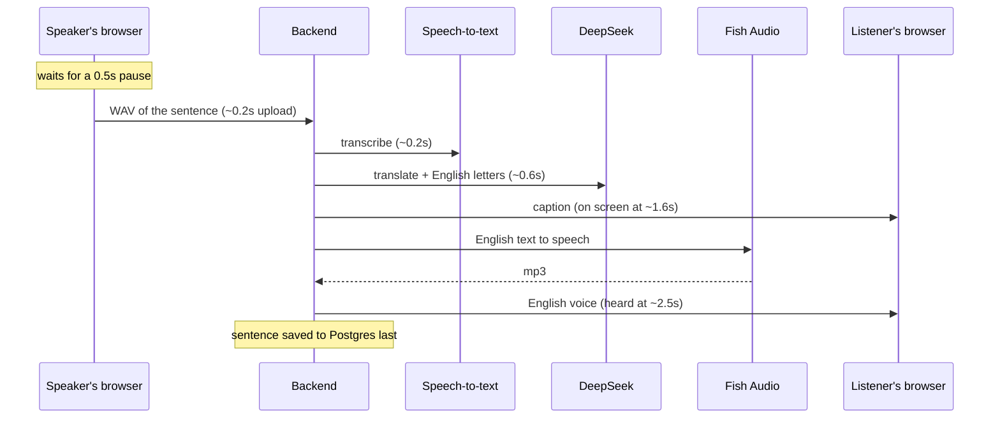

# Meet Translate

Video meetings where people speaking **Hindi, Telugu, Tamil or Kannada** are
heard in **English** by everyone else — as a live caption and a spoken
English voice, with the original speaker muted for English listeners.

Under each English caption, what the speaker actually said is shown in
English letters, the way people type Hindi or Telugu on their phone,
instead of in the native script:

> **How are you? Let's start today's meeting.**
> Hindi: aap kaise hain chaliye aaj ki meeting shuru karte hain

So an English listener who half-knows the language can follow the original
too.

## In the meeting

- **Pick the language you will speak.** English means "I want to hear
  everyone else in English". A line under the header says what your choice
  does right now, including when nothing is being translated because nobody
  is on English. It can be changed mid-call.
- **Captions** stay scrolled to the newest one, unless you scroll up to
  re-read.
- **Video tiles** show each person's name and language. Someone with no
  camera, or with it off, shows as their initial. Your own camera is
  mirrored, and your tile says "mic off" while you're muted.
- **Mute and Camera off turn red** while off. "Translated voice" (English
  listeners only) switches between the English voice and the speaker's own.
- Alone in a call, a tile offers the invite link to copy.

## Measured

On a real Fish-voiced sentence per language, through the whole app (speech →
text → English → spoken English), on a laptop CPU:

| | Caption on screen | English voice heard |
|---|---|---|
| Hindi / Telugu / Tamil / Kannada | 1.3–1.6s | 2.3–2.7s |

Target was under 4s. Times are counted from when the speaker pauses.

**Real two-person call** (two people, two devices, different networks,
Hindi speaker → English listener and back): server time from receiving a
sentence to sending its caption was **0.79s median, 1.5s for 90% of
sentences**, over 75 sentences. Most mistakes in that call came from someone
being on the wrong language, which is what the hint line above now
addresses.

## Three parts

| Folder | What | Stack |
|---|---|---|
| `frontend/` | The meeting page: video (WebRTC), voice detection, captions | Next.js, React, TypeScript, Tailwind |
| `backend/` | Signalling, the translation pipeline, saved transcripts | NestJS, Prisma, PostgreSQL, Socket.IO |
| `asr/` | Speech-to-text for the four Indian languages | Python, FastAPI, AI4Bharat IndicConformer |

`asr/` is Python only because the model ships as Python code. It runs locally
on the CPU (~0.2s per phrase), so it costs nothing per use.

### Which service does what, and why

| Step | Used | Why this one |
|---|---|---|
| Is the mic audio speech? | **Silero VAD** (in the browser) | A loudness check let clicks, noise and the translated voice through as "speech" |
| Speech → text (Indian languages) | **IndicConformer** (local) | Fish returned gibberish for Telugu/Tamil/Kannada and took 4–6s; this got them right in ~0.2s |
| Speech → text (English) | **Fish Audio** | Accurate for English |
| Text → English, plus the original in English letters | **DeepSeek** (`deepseek-flash`, thinking off) | ~0.5–1s, free token grant on signup. Kept over a faster local translator (IndicTrans2) for accuracy. Both come back from one call as JSON `{english, romanized}`, so the English-letters line adds no delay. A rule-based transliterator was the other option, but it spells stiffly (`Aja kI mITiMga`) |
| English text → voice | **Fish Audio** | Consistent voice (`FISH_VOICE_ID`) |

## System design



**Two separate paths.** Video and the speaker's real voice go straight
between browsers over WebRTC and never touch the server; the backend only
passes along the connection details (signalling). Translation is the other
path: one WAV per sentence goes to the backend, and the caption and English
voice come back over the same Socket.IO connection.

**One sentence, end to end** (typical timings; the server step was measured
on the real call, the rest are estimates):



**What keeps it fast**
- The caption goes out the moment the translation exists; it doesn't wait
  for the voice.
- The voice is pushed only to English listeners, with no extra request.
- Saving to Postgres happens after the caption, so it never adds delay.
- Nothing is translated unless someone is listening in English.
- The translation and the English-letters line come from one DeepSeek call.

**Live state vs. history.** Who is in a meeting right now (connection,
name, language) is kept in memory (`PresenceService`): signalling and the
"is anyone listening in English?" check read it all the time, and an open
connection isn't something a database row can represent. History lives in
Postgres: `Meeting` → `Participant` → `Utterance` (original text, English
letters, translation).

**When something fails**
- A Fish/DeepSeek error (no credit, bad key) reaches the speaker with the
  real reason, not a blank 500.
- If the voice fails, the caption has already arrived.
- If saving fails, it's logged and the call carries on.
- `GET /api/health` reports whether the database and the speech-to-text
  service are up.
- If video can't connect on a strict network, captions and voice still
  work, since they go through the server.

**Limits, and how it would scale**

| Limit today | Why | How it would scale |
|---|---|---|
| ~6 people per meeting | Everyone connects to everyone (6 people = 15 connections) | A media server (SFU, e.g. LiveKit): each person sends one stream |
| Speech-to-text throughput | One CPU process, ~0.2s per sentence | More worker processes behind a queue; a GPU with batching at higher volume |
| One backend server | Who is online lives in one server's memory | Move it to Redis, with Socket.IO's Redis adapter |
| Translation is the slowest step | DeepSeek, 0.5–1.5s and paid per call | Streaming, caching repeated phrases, or a local translator once one is accurate enough |
| No login or usage limits | Anyone with the link can spend credit | Meeting passwords or login, plus per-meeting limits |
| Video on strict networks | STUN only, no relay | A TURN server (coturn) |

## Decisions, and what each was based on

Each of these was decided by testing the alternatives, not by guessing.

**1. A local model for Indian-language speech-to-text, not Fish.**
Fish got Hindi right, but returned Telugu, Tamil and Kannada as Malay
gibberish (it detected the language as "ms"), taking 4–6s per sentence. Its
language hint doesn't force the language. AI4Bharat's IndicConformer, built
for Indian languages, got all four right in ~0.2s, runs locally and costs
nothing per sentence. Fish is still used for English, where it's accurate.

**2. CPU, not GPU, for that model.** Counter-intuitive, but measured: the
GPU (RTX 4050) took ~450ms per sentence against ~190ms on the CPU, because
this model's GPU kernels are slow. Tuning the CPU (8 threads, no
busy-waiting) also cut the time under load from 672ms to 343ms.

**3. Accuracy over speed for translation: DeepSeek, not IndicTrans2.**
IndicTrans2 (a local translator) was faster, 0.3–0.4s against 0.5–1s, but
on real speech-to-text output it merged separate sentences ("how are you
starting today's meeting") and translated misheard words literally.
DeepSeek works out where sentences end and repairs mishearings, so it stayed.

**4. One translator call returns both lines.** The English translation and
the speaker's words in English letters ("aaj ki meeting mein kya hua") come
back together as JSON, so the second line adds no delay. A rule-based
transliteration library was the other option, but it spells the way nobody
types ("Aja kI mITiMga").

**5. An AI voice detector in the browser, not a loudness check.** The
loudness check let clicks, background noise and the app's own English voice
through as "speech", which then got translated. Silero VAD recognises actual
speech, and the mic is ignored while the English voice plays.

**6. Caption first, voice second, original muted.** The caption used to
wait for the English voice to be generated. Now it goes out as soon as the
translation exists, and the voice follows only to English listeners. The
original speaker is muted for them, so they never hear a few seconds of
Hindi before the English.

**7. Translate only into English, and only when someone is listening in
English.** A longer language list was tried first. People picked the wrong
language by mistake, which produced garbled captions. Fewer options, and no
translation calls when nobody needs one, which saves credit.

**8. One fixed voice, and DeepSeek's "thinking" turned off.** Fish chose a
different default voice per sentence, so it is pinned (`FISH_VOICE_ID`).
DeepSeek's reasoning step added delay for no gain on one-sentence
translations. The setting that looks like it turns it off
(`reasoning.effort`) is silently ignored; `thinking: {type: 'disabled'}`
is the one that works.

**9. Fixes driven by a real call.** A two-person test on separate devices
and networks showed most mistakes came from people being on the wrong
language, including both being on Hindi with nothing translated. The answer
was clearer labels and a line that says what your choice means right now,
not more features. The same call caught Fish captioning a cough as "啊",
which is now filtered out.

**10. Not deployed, on purpose.** The speech model needs ~3–4 GB of memory,
which rules out free hosting, and a public link would let anyone spend the
translation and voice credit. Live demos run from a laptop through a free
Cloudflare tunnel instead.

## Running it

1. **Speech-to-text service** (first time: download the model, ~2.4 GB —
   needs a free Hugging Face token in `asr/.env` as `HF_TOKEN=...` and
   access accepted on the
   [model page](https://huggingface.co/ai4bharat/indic-conformer-600m-multilingual)):
   ```bash
   cd asr
   uv sync
   uv run python download_model.py
   uv run uvicorn main:app --port 5001
   ```
2. **Backend** — see `backend/README.md` for `.env` (Postgres, Fish, DeepSeek):
   ```bash
   cd backend
   npm install
   npx prisma migrate dev
   npm run start
   ```
3. **Frontend**:
   ```bash
   cd frontend
   npm install
   npm run dev
   ```

Open http://localhost:3000, create a meeting, share the link.

**Testing two people on one laptop:** both browsers hear the same microphone,
so mute one of them and use headphones — otherwise each voice is picked up
twice and the translated voice gets re-captured.
